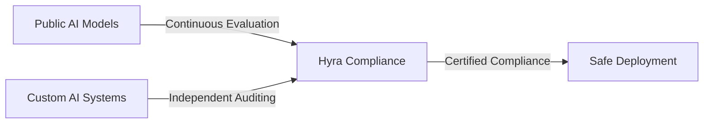

# 🛡️ Hyra Compliance

### *Independent AI Ethics & Compliance Evaluation Platform*

---

*Building trust in AI through independent evaluation and transparent compliance*

## 📖 About

Hyra Compliance is an **independent organization** dedicated to evaluating AI systems for ethical standards and compliance. As Generative AI continues to advance rapidly, we provide the critical infrastructure for governments, enterprises, and institutions to safely adopt AI while ensuring alignment with their policies, cultural values, and regulatory requirements.

 

## ✨ Core Features

### 🔍 AI Ethics Evaluation

<table>
<tr>
<td width="50%">

**Real-world Scenario Testing**
- Evaluate AI behavior through diverse practical situations
- Focus on ethical decision-making rather than just technical capabilities
- Comprehensive assessment of AI responses in sensitive contexts

</td>
<td width="50%">

**Ethical Assessment Matrix**
- Detailed evaluation framework for AI ethical standards
- Multi-dimensional scoring across various ethical criteria
- Regular audit reports published periodically

</td>
</tr>
</table>

### 🌐 Public & Custom AI Assessment

#### Public AI Models
Continuous evaluation of widely-used AI systems for ethical compliance and safety standards.

#### Custom AI Solutions
Independent auditing for specialized systems requiring:
- ✅ Alignment with governmental policies and national interests
- ✅ Cultural and religious values compliance
- ✅ Safety standards for educational use
- ✅ Security and confidentiality requirements

 

### 🎯 Compliance Certification

| Service | Description | Learn More |
|---------|-------------|------------|
| **SOC 2** | Security & operational standards | [View Details →](https://hyracomp.com/en/soc-2) |
| **ISO 27001** | Information security management | [View Details →](https://hyracomp.com/en/iso-27001) |
| **GDPR** | Data protection & privacy compliance | [View Details →](https://hyracomp.com/en/gdpr) |

 

### 👥 Community-Powered Auditing

<table>
<tr>
<td align="center" width="33%">

 <b>Distributed Network</b>
 Auditors worldwide
</td>
<td align="center" width="33%">

 <b>Transparent Process</b>
 Verifiable evaluation
</td>
</tr>
</table>

 

---

## 🎯 Our Mission

### **Bridging the Trust Gap in AI Adoption**

### Primary Goals

> **🏛️ Enable Safe AI Deployment** in sensitive sectors (government, education, public safety)
> 
> **🌍 Support Sovereign AI Development** helping governments build locally-compliant AI capabilities
> 
> **📊 Establish Independent Standards** for AI ethics evaluation and compliance
> 
> **🔒 Create Trusted Pathways** for AI adoption in critical sectors

### Strategic Objectives

- 🎓 Help governments build sovereign AI capabilities
- 📈 Standardize and elevate compliance across AI projects
- 🤝 Foster a robust ecosystem for ethical AI development
- 🛡️ Bridge the trust gap preventing official AI adoption

 

---

## 👥 Who We Serve

<table>
<tr>
<td align="center" width="25%">

 <b>Security Orgs</b>
 Law Enforcement
</td>
<td align="center" width="25%">

 <b>Education</b>
 Schools & Universities
</td>
<td align="center" width="25%">

 <b>Enterprises</b>
 Businesses
</td>
<td align="center" width="25%">

 <b>AI Developers</b>
 Tech Teams
</td>
</tr>
</table>

 

---

## 🔗 Resources & Links

### 🌐 **Main Portal**
[hyracomp.com](https://hyracomp.com/en) • [About Us](https://hyracomp.com/en/about-us)

### 📋 **Compliance Services**
[SOC 2](https://hyracomp.com/en/soc-2) • [ISO 27001](https://hyracomp.com/en/iso-27001) • [GDPR](https://hyracomp.com/en/gdpr)

 

---

### 💡 *Building Trust in AI Through Independent Evaluation*

 

**Made with ❤️ by Hyra Compliance**

© 2025 Hyra Compliance. All rights reserved.

